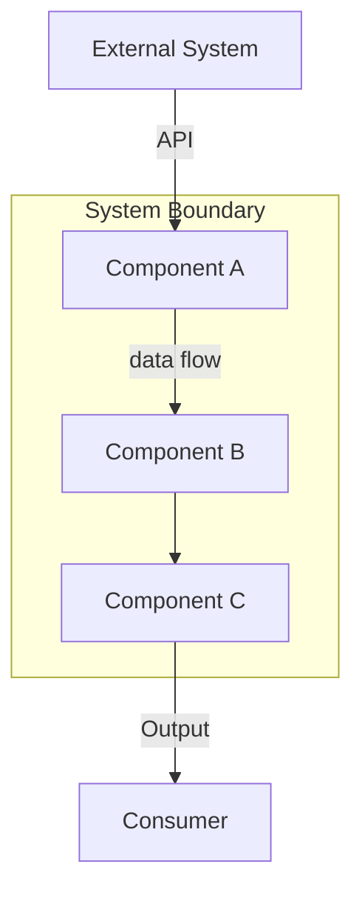
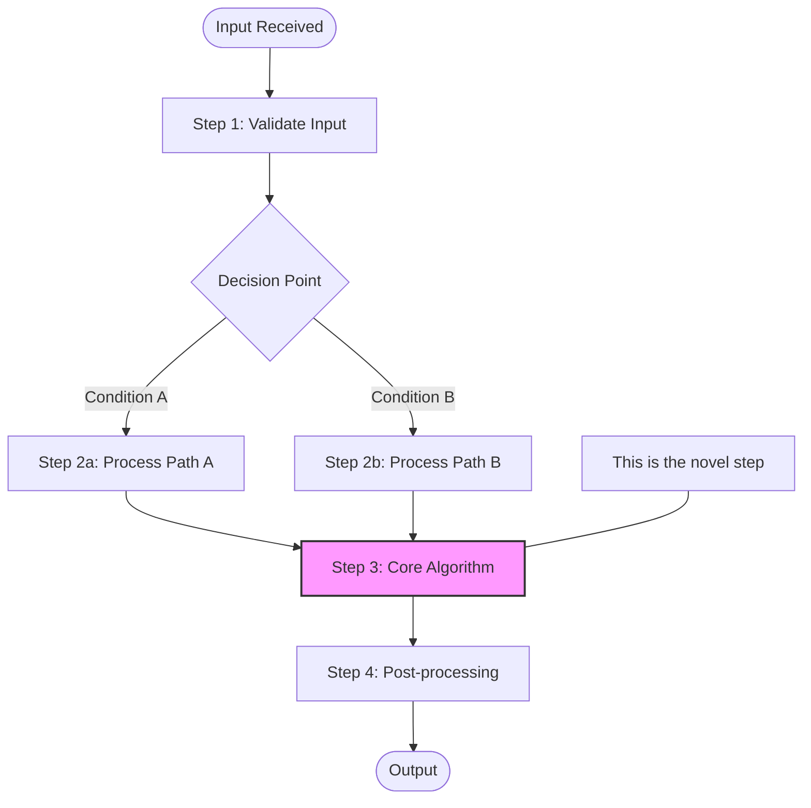
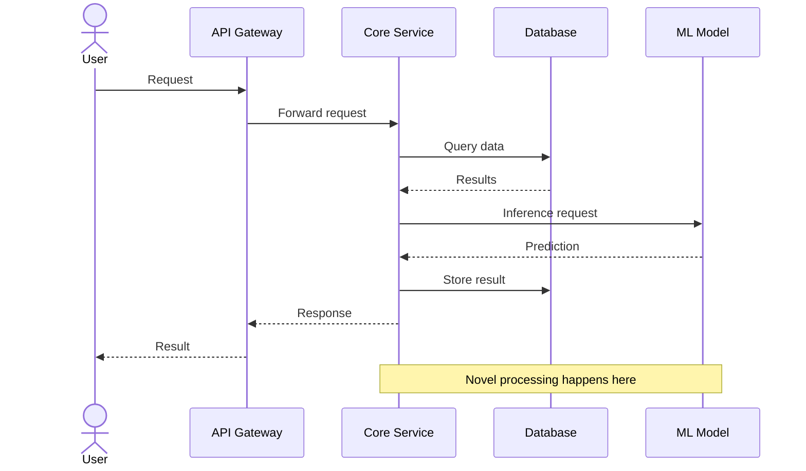
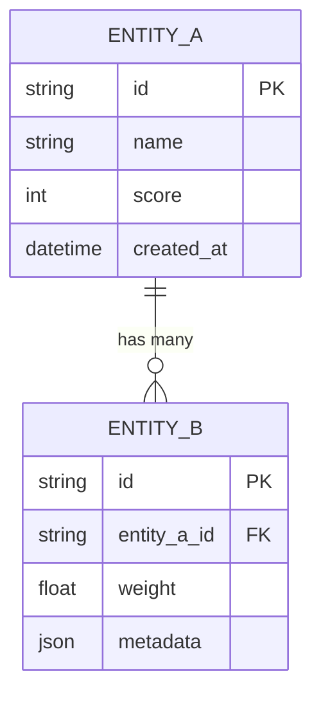
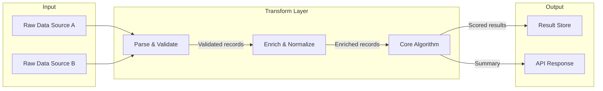
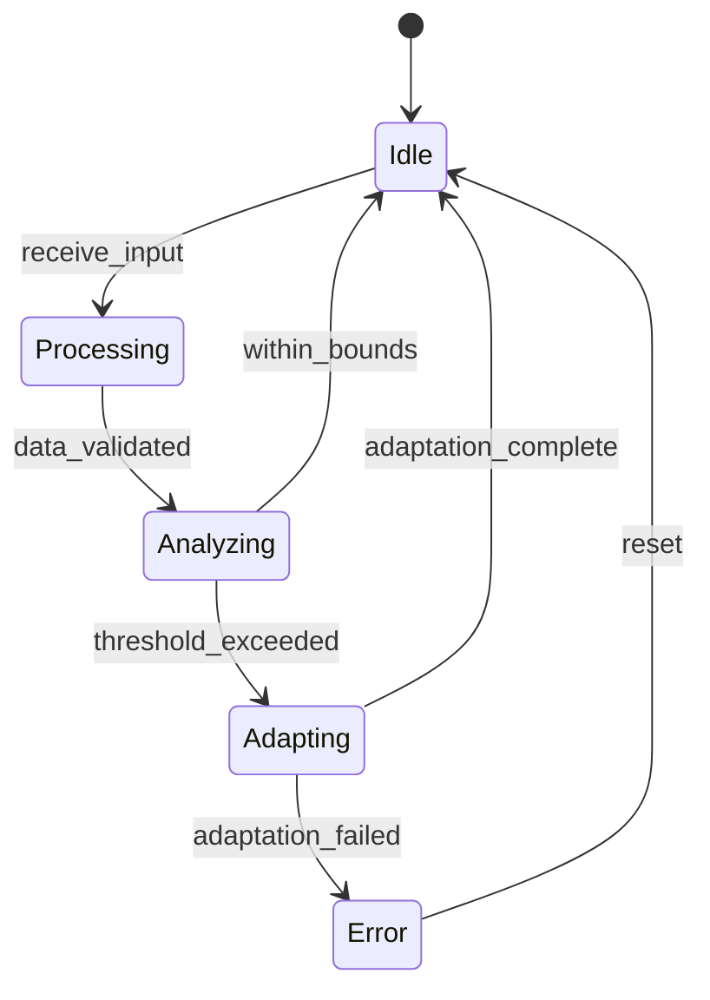

# Diagram Generation Guidelines

Every patent disclosure MUST include comprehensive diagrams. Visual representations are critical for patent attorneys and examiners — they often understand the invention faster from a diagram than from text.

## Required Diagrams

Every disclosure must include AT MINIMUM these diagrams. Generate them as Mermaid blocks within the markdown.

### 1. System Architecture Diagram (Required)

Show the high-level components and their relationships. Use a `graph` diagram.

**Rules:**
- Show ALL significant components
- Label every arrow with what flows along it (data type, protocol, event)
- Use subgraphs to group related components
- Distinguish external systems from internal components
- Show data stores (databases, caches, queues) as distinct shapes

### 2. Processing Pipeline Flowchart (Required)

Show the step-by-step processing from input to output. Use a `flowchart` diagram.

**Rules:**
- Include EVERY processing step, not just the important ones
- Use decision diamonds for branching logic
- Highlight novel steps with distinct styling (colored fill)
- Show error/fallback paths as dashed lines
- Use round-edge boxes for start/end, rectangles for processes, diamonds for decisions

### 3. Sequence Diagram — Core Operation (Required)

Show the interaction between components over time for the main use case.

**Rules:**
- Show the complete request lifecycle for the primary use case
- Include ALL participants (actors, services, stores, external systems)
- Use solid arrows for requests, dashed for responses
- Add `Note` blocks to highlight where novel processing occurs
- Show async operations with `activate/deactivate` blocks
- Include error/retry flows if they're part of the invention

### 4. Entity Relationship Diagram (Required if data structures are significant)

Show data structure relationships.

### 5. Data Flow Diagram (Required)

Show how data is transformed as it moves through the system.

### 6. State Diagram (Required if the invention involves state machines or lifecycle management)

## Optional but Recommended Diagrams

- **Class Diagram** — if the invention's OOP design is significant
- **Gantt Chart** — if the invention involves scheduling or time-based processing
- **Pie Chart** — for showing distribution of workload or resource allocation
- **Mindmap** — for showing the taxonomy of concepts within the invention

## Diagram Quality Standards

1. **Every node must be labeled clearly** — no anonymous boxes
2. **Every edge must describe what flows** — no unlabeled arrows
3. **Novel elements must be visually distinguished** — use color, bold borders, or annotations
4. **Diagrams must be consistent with the text** — component names, data types, and flows must match
5. **Each diagram must have a descriptive caption** explaining what it shows
6. **Keep diagrams readable** — if a diagram has >20 nodes, split it into multiple focused diagrams
7. **Use consistent naming** across all diagrams in the disclosure
