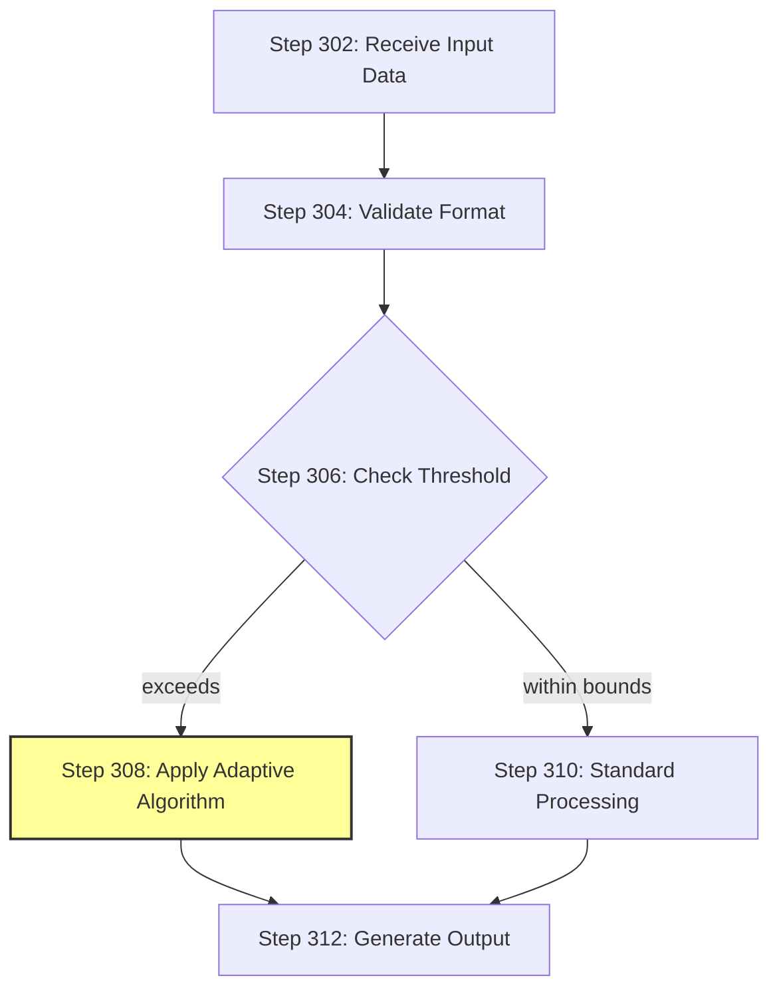
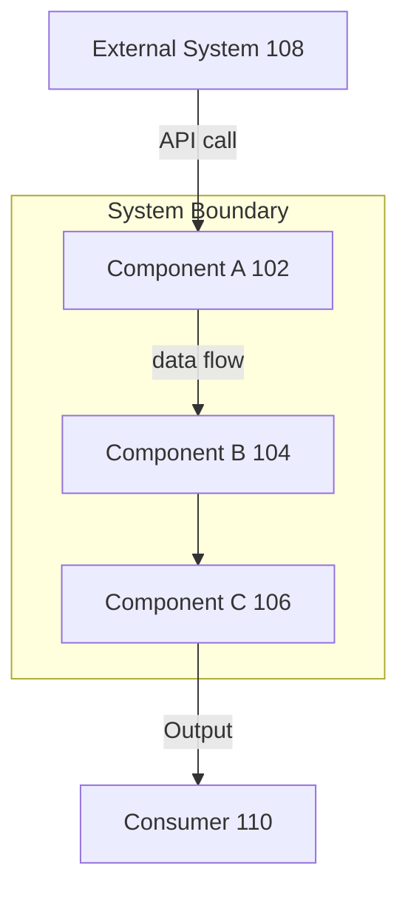
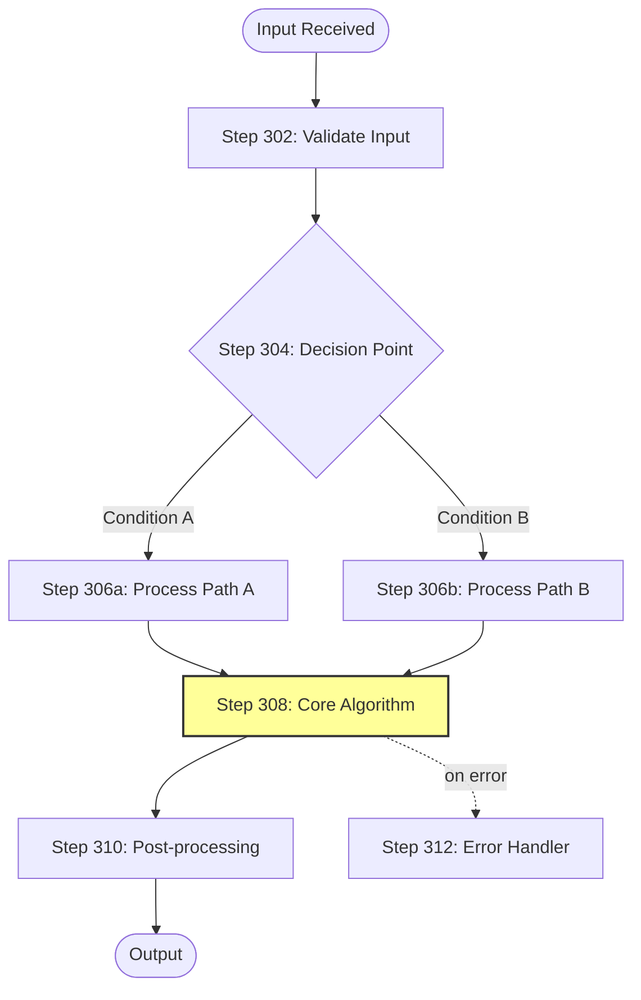
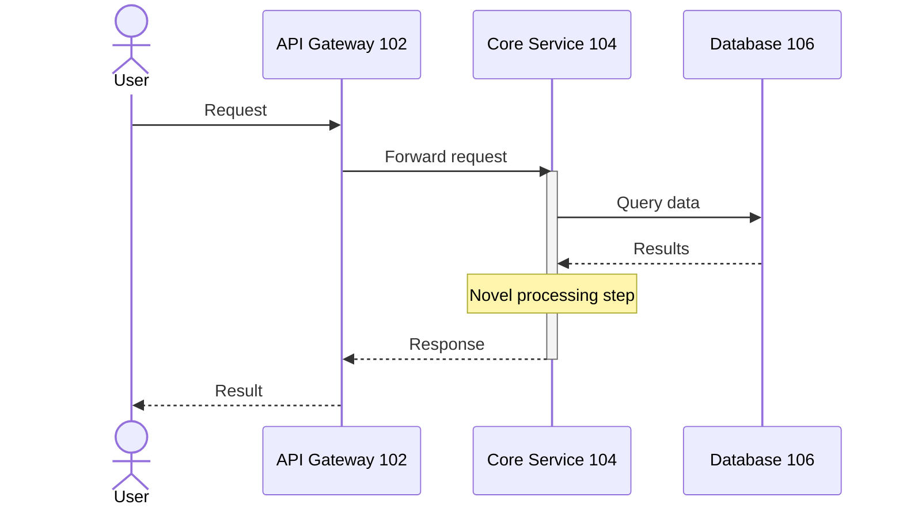
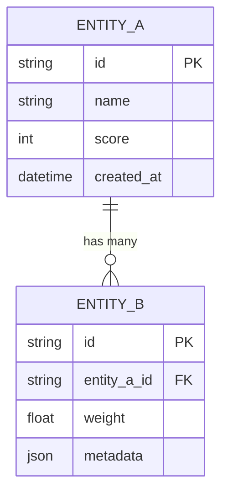
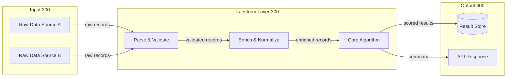
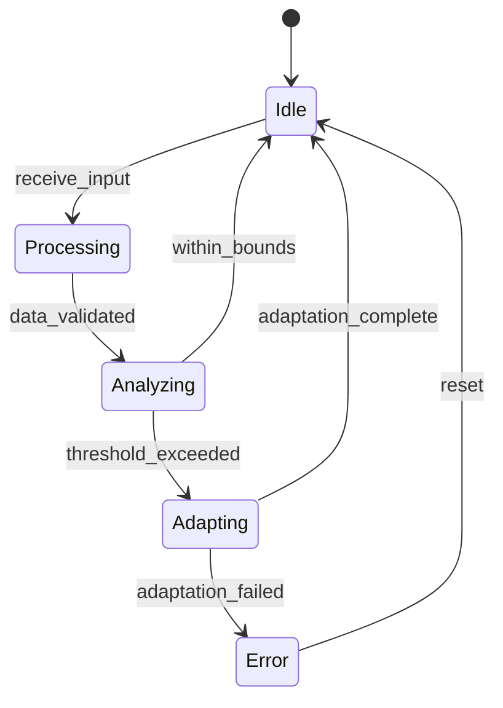

# Diagram Generation Guidelines

Patent disclosures should include diagrams in sections where visual representation aids understanding. Diagrams are critical for patent attorneys and examiners. However, only include diagrams where they add value — do not force diagrams into narrative sections.

## Which Sections Need Diagrams

| Section | Required Diagrams | Notes |
|---------|------------------|-------|
| What It Does & How It Works | System architecture, processing pipeline flowchart, sequence diagram | Always required |
| Data Structures | ER diagram | Required if custom data structures exist |
| Implementation Details | Component interaction diagram | Required |
| Case Studies | Walkthrough diagram | Recommended, not required |
| All other sections | None | Only if it genuinely helps understanding |

## Patent-Style Reference Numerals

Patent figures use numbered reference numerals to identify elements. Use these in diagrams where practical:

- Use 100-series for system components (Processor 102, Memory 104, Network Interface 106)
- Use 200-series for data elements (Input Data 202, Intermediate Result 204, Output 206)
- Use 300-series for method steps (Step 302: Receive Input, Step 304: Validate, Step 306: Process)

Example in a flowchart:

## Diagram Types and Syntax

### 1. System Architecture Diagram

Show high-level components and relationships.

**Rules:**
- Show ALL significant components
- Label every arrow with what flows along it (data type, protocol, event)
- Use subgraphs to group related components
- Distinguish external systems from internal components
- Show data stores (databases, caches, queues) with cylinder notation `[("DB")]` or distinct labels

### 2. Processing Pipeline Flowchart

Show step-by-step processing from input to output.

**Rules:**
- Include EVERY processing step, not just the important ones
- Use decision diamonds `{}` for branching logic
- Highlight novel steps with `style NodeName fill:#ff9,stroke:#333,stroke-width:2px`
- Show error/fallback paths as dashed lines `-.->` 
- Use round-edge boxes `([])` for start/end, rectangles `[]` for processes, diamonds `{}` for decisions
- Always quote labels that contain special characters: `["Step: Process"]`

### 3. Sequence Diagram

Show component interactions over time.

**Rules:**
- Show the complete request lifecycle for the primary use case
- Include ALL participants (actors, services, stores, external systems)
- Use solid arrows `->>` for requests, dashed `-->>` for responses
- Use `Note over` blocks to highlight where novel processing occurs
- Use `activate/deactivate` blocks for long-running operations
- Do NOT use `style` directives in sequence diagrams (not supported)

### 4. Entity Relationship Diagram

Show data structure relationships. Only in Data Structures section.

### 5. Data Flow Diagram

Show data transformations through the system.

### 6. State Diagram (only if the invention involves state machines)

Note: `style` directives are NOT supported in state diagrams.

## Diagram Quality Standards

1. **Every node must be labeled clearly** — no anonymous boxes
2. **Every edge must describe what flows** — no unlabeled arrows
3. **Novel elements must be visually distinguished** — use `style` in flowcharts, `Note` in sequence diagrams
4. **Diagrams must be consistent with the text** — component names, data types, and flows must match
5. **Each diagram must have a descriptive caption** as a markdown heading before the mermaid block
6. **Keep diagrams readable** — if a diagram has >20 nodes, split it into multiple focused diagrams
7. **Use consistent naming** across all diagrams in the disclosure
8. **Always quote labels with special characters** — `["Label: with colon"]` not `[Label: with colon]`
9. **Styling varies by diagram type:**
   - Flowcharts: `style NodeName fill:#ff9,stroke:#333,stroke-width:2px`
   - Sequence diagrams: use `Note over` and `rect` blocks
   - ER diagrams: no styling available
   - State diagrams: no styling available
