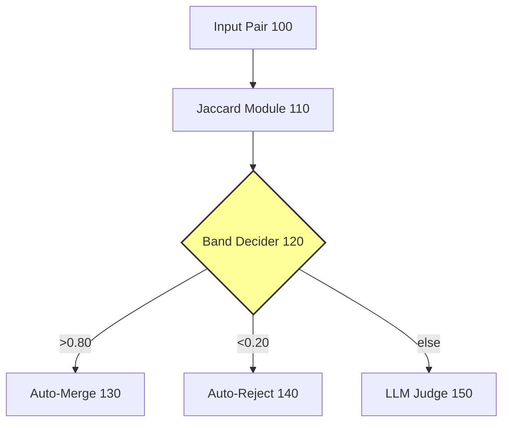
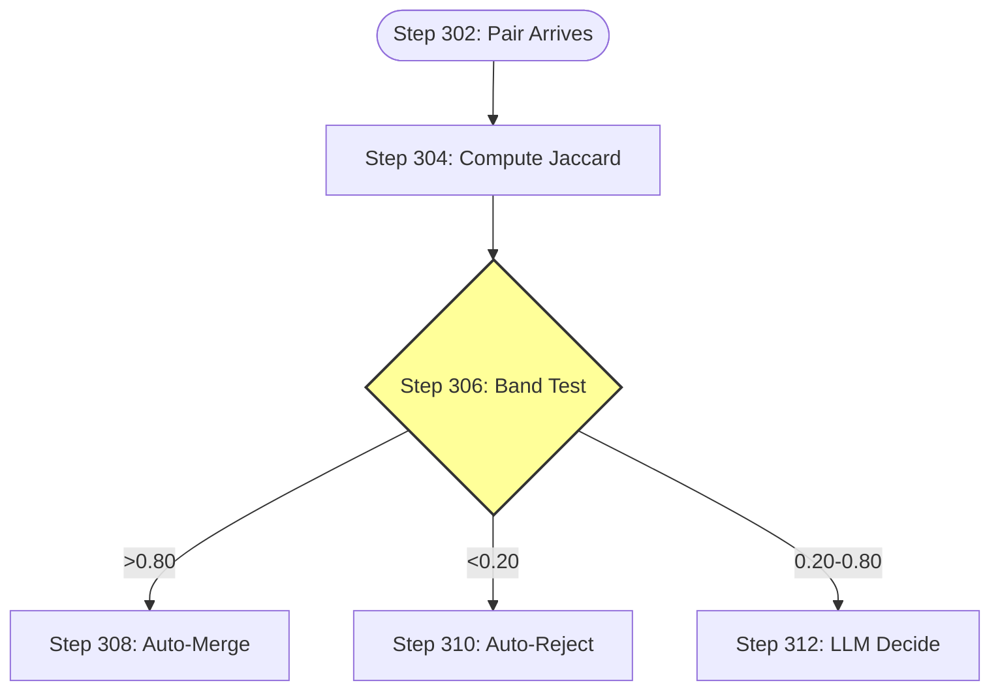
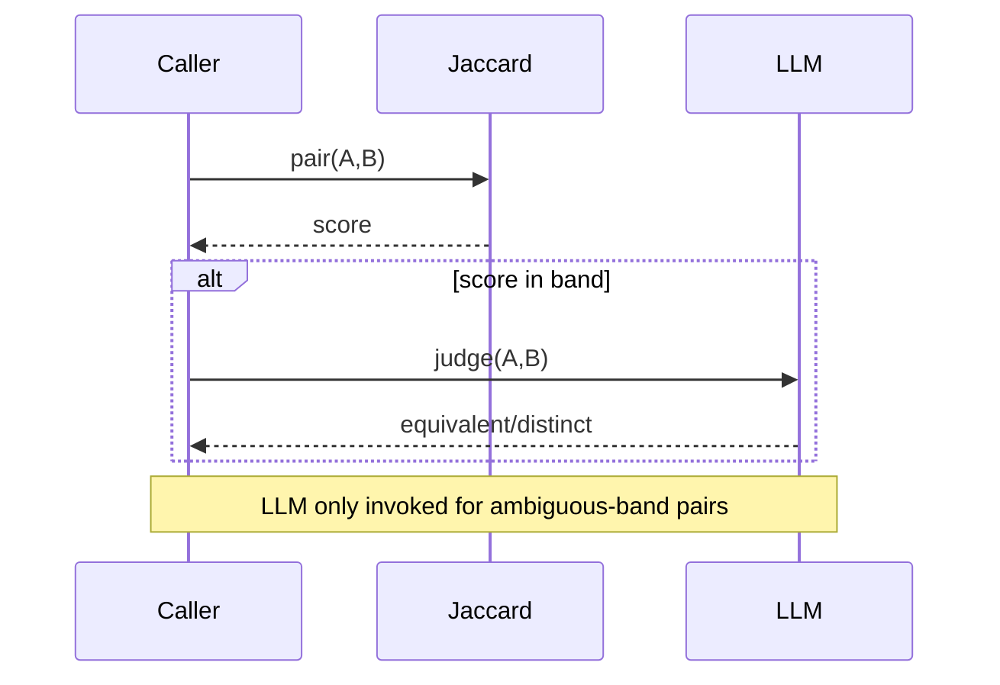
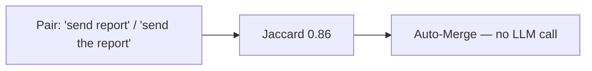
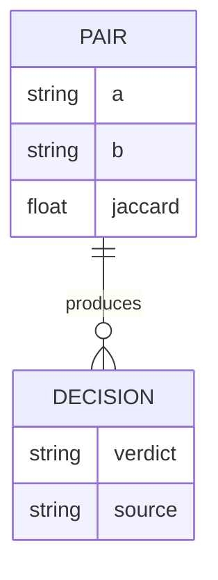
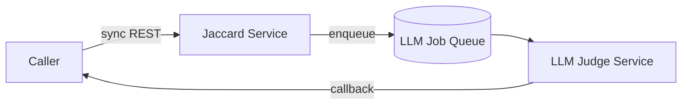

# Patent Disclosure: Synthetic Smoke-Test Invention

## 1. Executive Summary

A two-stage thresholded classifier with a deterministic auto-decide band and a model-decide ambiguous band.

## 2. Novelty

The inventive contribution is the band boundary at 0.20 — pairs below 0.20 are auto-rejected, eliminating model invocations for the trivial-mismatch tail.

## 3. Context

Operates inside an LLM-backed pipeline where each model call is a billable tool invocation.

## 4. Problems Solved

Single-stage classifiers either incur full LLM cost on every pair or use an arbitrary cutoff that loses recall.

## 5. Introduction

Defines the terms `auto_merge_threshold`, `auto_reject_threshold`, and `model_decide_band`.

## 6. What It Does and How It Works

The system architecture is shown in Figure 1; the processing pipeline is shown in Figure 2; the end-to-end interaction is in Figure 3.







## 7. Case Studies



## 8. Pseudocode

```
function classify(pair):
    s = jaccard(pair.a, pair.b)         // [STANDARD]
    if s > 0.80: return MERGE            // [NOVEL] auto-decide tail
    if s < 0.20: return REJECT           // [NOVEL] auto-reject tail
    return llm_decide(pair)              // ambiguous band only
```

## 9. Data Structures



## 10. Implementation Details

The runtime topology is shown in the component-interaction diagram below. The Jaccard module runs inline in the request path; the LLM judge is called via an async queue.



## 11. Alternatives & Comparison

Single-stage classifiers (LLM-only or threshold-only) are discussed in §11.

## 12. Prior Art

Record-linkage literature (Fellegi-Sunter, Christen) covers calibrated probabilistic gray-zones; the band-boundary inventive contribution is distinct.

## 13. Draft Patent Claims

1. A method comprising: receiving a pair; computing a Jaccard score; auto-merging when the score exceeds a first threshold; auto-rejecting when the score is below a second threshold; and invoking a model judge for scores between the thresholds.
